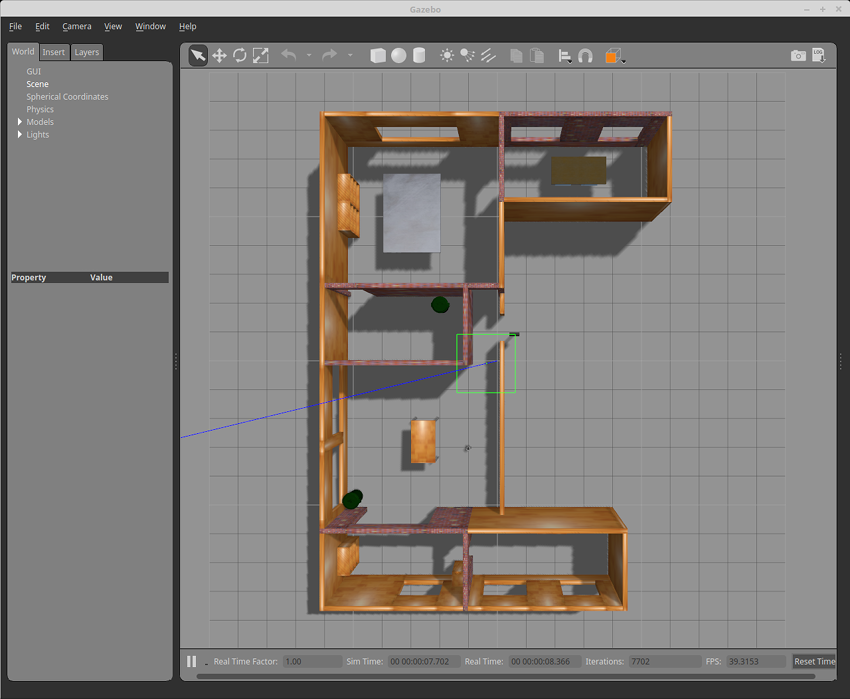
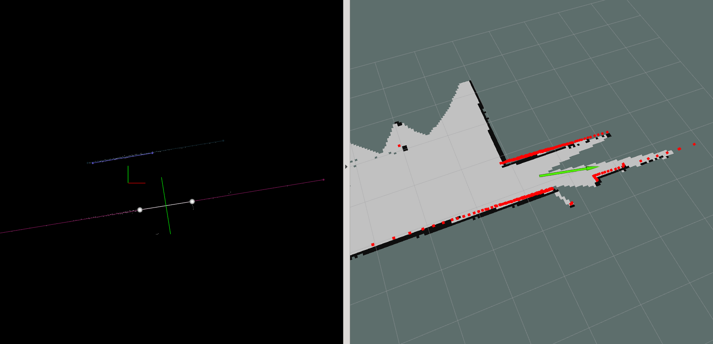
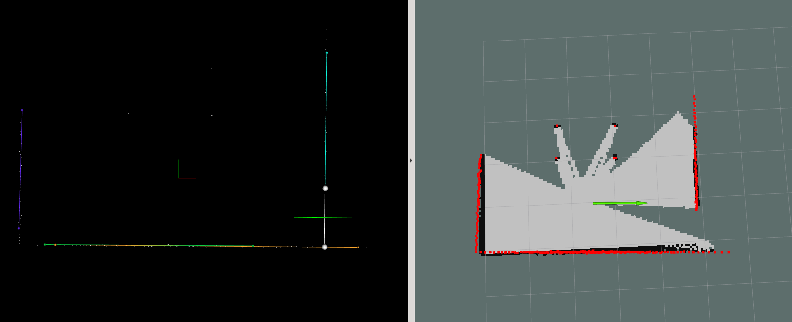

# ROS Door Detector

This ROS package detects doors using a 2D lidar

# How to

## Launch

Use the roslaunch file in the `launch/` directory to launch the node with parameters specified in `launch/params.yaml`.

# Demo

## Demo Setup

The package is tested with the turtlebot-gazebo package's house map

## Detecting a door on a flat wall

A door at the middle of a wall divides the wall.

In the example below, left image shows the PCL viewer's view while the right side 
shows the map in rviz. A detected door is shown in the PCL viewer view with a white 
line. The green line perpendicular to it shows a possible path through the door.

## Detecting a door on a corner

A door like passage can be formed by two perpendicular walls which does not intersect.

In the example below, the detected door and the possible path is shown similar to the 
previous example.

# TODO

## Bugs

1. Publishing the paths throws a `ros::serialization::StreamOverrunException` error (possibly due to the publish rate)
2. Multiple overlappint line detections (Need to be fixed without affecting the detected line's accuracy)